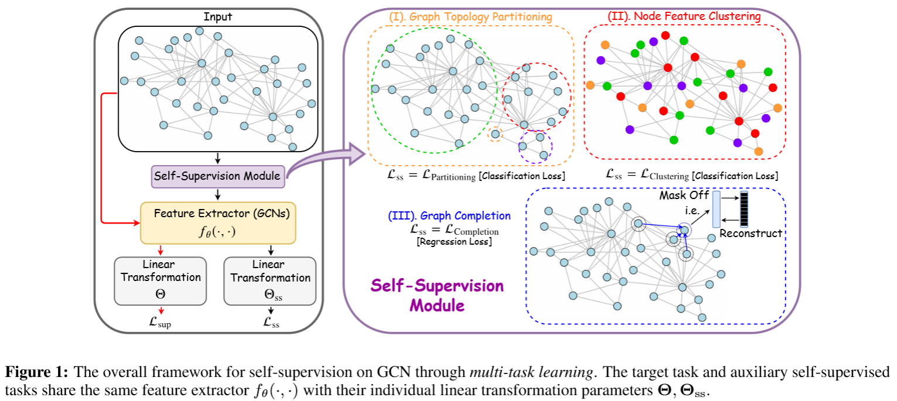

# When Does Self-Supervision Help Graph Convolutional Networks?

[](https://opensource.org/licenses/MIT)

Code for [When Does Self-Supervision Help Graph Convolutional Networks?](https://arxiv.org/abs/2006.09136)

Yuning You<sup>\*</sup>, Tianlong Chen<sup>\*</sup>, Zhangyang Wang, Yang Shen

In ICML 2020.

## Overview

Properly designed multi-task self-supervision benefits GCNs in gaining more generalizability and robustness.
In this repository we verify it through performing experiments on several GCN architectures with three designed self-supervised tasks: node clustering, graph partitioning and graph completion.



## Dependencies

Please setup the environment following Section 3 (Setup Python environment for GPU) in this [instruction](https://github.com/graphdeeplearning/benchmarking-gnns/blob/master/docs/01_benchmark_installation.md#3-setup-python-environment-for-gpu), and then install the dependencies related to graph partitioning with the following commands:

```
sudo apt-get install libmetis-dev
pip install METIS==0.2a.4
```

## Experiments

* [GCN, GAT and GIN with self-supervision](https://github.com/Shen-Lab/SS-GCNs/tree/master/SS-GCNs)

* [GMNN and GraphMix with self-supervision](https://github.com/Shen-Lab/SS-GCNs/tree/master/SS-GMNN-GraphMix)

* [GCN with self-supervision in adversarial defense](https://github.com/Shen-Lab/SS-GCNs/tree/master/SS-GCN-adv)

## Citation

If you use this code for you research, please cite our paper.

```
TBD
```
